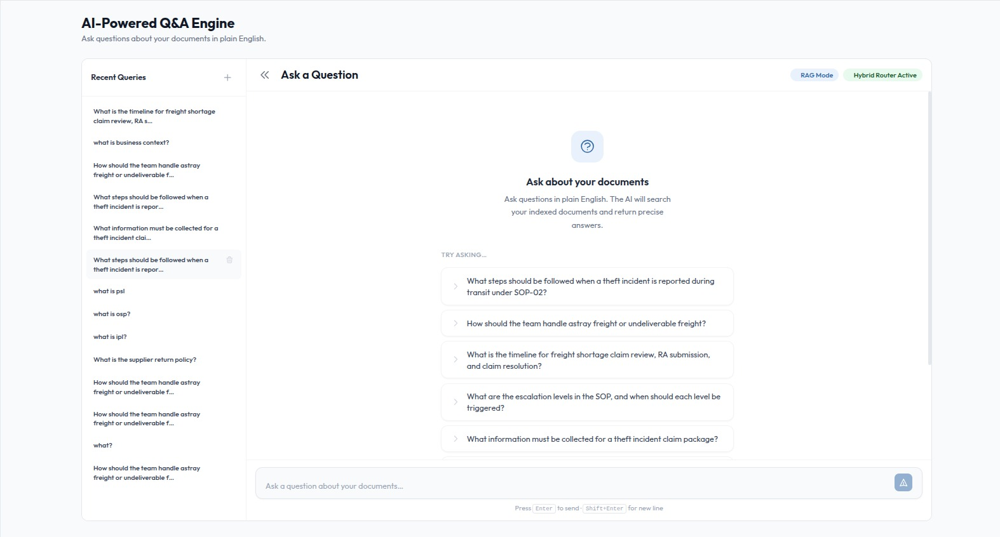

# Knowledge Hub

Upload your documents, ask away, and get grounded answers with citations.

Knowledge Hub is a full stack retrieval augmented generation platform for internal document question answering.
It combines a Next.js client, a Node.js application server, and a FastAPI based AI pipeline with document ingestion, retrieval, citation, and answer generation.
Company identity and domain vocabulary are designed to be customized primarily through `config/company_profile.json`, while infrastructure and secrets remain environment based.

## Product Preview

<p align="center">
  
</p>

The platform provides a focused Q and A workspace with conversation history, routed retrieval mode visibility, and grounded document answering over indexed private content.

## RAG Workflow At A Glance

<p align="center">
  
</p>

Knowledge Hub is designed for document heavy environments where teams need to ingest large internal knowledge bases, retrieve the right evidence, and generate answers that remain tied to source material.

## Overview

Knowledge Hub is built for teams that need grounded answers from private operational documents instead of generic chatbot output. The system ingests business content, indexes it for retrieval, and produces answers that stay tied to source material.

The repository is organized as a monorepo with three main application layers:

1. `client`
   A Next.js frontend for authentication, document management, system monitoring, and Q and A workflows.

2. `server`
   An Express based application server that handles authentication, RBAC, user management, document workflows, email flows, and integration with the AI service.

3. `ai_server`
   A FastAPI based RAG service with ingestion, chunking, embedding, retrieval, reranking, citation building, faithfulness checks, and answer generation.

## Core Capabilities

1. Document upload and ingestion for PDF, DOCX, PPTX, XLSX, JPG, JPEG, PNG, and TIFF inputs.

2. Retrieval augmented question answering with citations and deterministic safeguards.

3. Multi stage and multi agent AI pipeline for domain gating, query understanding, context detection, reformulation, retrieval planning, answer generation, citations, and faithfulness checks.

4. Company aware branding and vocabulary driven from shared configuration.

5. Authentication, user management, and role based access control for enterprise deployments.

6. Admin workflows for monitoring, operational visibility, and document governance.

## Multi Agent Pipeline

The AI system uses a staged routing and answer pipeline rather than a single prompt call.

### Group 1 routing layer

1. Stage 0
   Deterministic domain gate that fast rejects clearly out of domain requests, fast accepts strong in domain requests, and escalates borderline cases to the LLM.

2. Stage 1
   Query understanding that classifies domain fit, answer style, output format, and response length intent.

3. Stage 2
   Context mode classification that decides whether a request is a standalone question, a retrieval follow up, an answer transform request, or a citation lookup.

4. Stage 2a
   Follow up reformulation that rewrites vague follow up questions into a standalone retrieval query when needed.

5. Stage 2b
   Retrieval planning that separates user supplied case facts from document evidence needs and creates one or more bounded retrieval subqueries.

### Query pipeline layer

1. Step 1
   Retrieval gate that executes routed retrieval against the shared Qdrant collection, applies category filters, and optionally reranks results.

2. Step 2
   Confidence gate that checks whether the retrieved evidence is strong enough to continue.

3. Step 3
   Prompt assembly that builds the final evidence grounded prompt with style aware chunk limits and planner context.

4. Step 4
   Answer generation through Ollama with model specific handling for no think generation paths.

5. Step 5
   Citation building and deterministic faithfulness checks over the final answer and supporting chunks.

6. Step 6
   Session memory updates for multi turn conversations, including stored citations, last answers, and prior retrieval context.

This design allows the application to refuse weak or unrelated questions early, reformulate follow ups, support answer transforms, and keep retrieval grounded in the user’s actual evidence needs.

## Supported File Inputs

The ingestion pipeline supports both text first and OCR based workflows.

1. PDF
   Text is extracted first. If the extracted text is too weak, the pipeline falls back to OCR. Tables are extracted when the normal PDF text path succeeds.

2. DOCX
   Paragraphs are read in document order and tables are extracted as dedicated table content.

3. XLSX
   Each sheet is converted into row based text and also serialized into table chunks.

4. PPTX
   Slide text is extracted slide by slide.

5. JPG, JPEG, PNG, TIFF
   Image inputs use OCR and then pass through the same cleaning, chunking, embedding, and indexing flow as other documents.

## Adaptive Chunking Strategy

Chunking is structure driven, not category driven.

The pipeline detects the cleaned document as one of three structural types:

1. `structured`
   Used for SOPs, manuals, policies, and strongly headed operational documents.
   Default chunk size `700`, overlap `100`.

2. `list_heavy`
   Used for checklists, short procedures, and bullet dense content.
   Default chunk size `600`, overlap `120`.

3. `narrative`
   Used for dense reports, prose, emails, and long paragraphs.
   Default chunk size `1000`, overlap `150`.

Dynamic chunking behavior includes:

1. heading aware section splitting for true structural headings

2. paragraph fallback for documents without chunker level headings

3. short section stitching to avoid overly fragmented chunks

4. sentence aware sliding windows for long sections

5. micro chunk merging for fragments under the minimum useful size

6. contextual prefix enrichment before embedding

7. deterministic re ingest behavior by replacing chunks for the same `doc_id`

The important implementation detail is that `category` is still stored for filtering, but it does not control chunk size.

## Table Handling

Tables are treated as first class retrieval units.

1. Raw tables are detected during extraction when supported by the source type.

2. Tables are serialized into markdown style table text.

3. Each serialized table is stored as a dedicated chunk.

4. Table chunks are appended after text chunks and are never split further.

5. Table metadata is preserved so the retriever and answer pipeline can cite table derived evidence cleanly.

## Retrieval Behavior

All document chunks live in a shared Qdrant collection, with category stored as payload metadata for filtering.

The retrieval stack supports:

1. dense vector retrieval

2. optional reranking for final chunk ordering

3. hybrid ready sparse plus dense retrieval architecture

4. category based filtering through the public API

5. deterministic citation lookup and answer transform bypass paths for specific conversational requests

## Shared Configuration

The main customization file is:

`config/company_profile.json`

This file controls:

1. Application name, tagline, and product description.

2. Logo and favicon asset paths used by the frontend.

3. Company legal name, short name, aliases, and domain summary.

4. Domain entities such as teams, systems, customers, carriers, warehouse partners, and abbreviations.

5. Suggested prompts and no result messaging for the Q and A experience.

6. Support, no reply, and seeded superadmin default email values.

For most branding and company specific behavior, a user should only need to update this file.

Infrastructure values are intentionally separate and still belong in environment files. These include database URLs, object storage endpoints, queue settings, model endpoints, public base URLs, and secrets.

## Technology Stack

1. Frontend
   Next.js 16, React 19, TypeScript, Tailwind CSS

2. Backend
   Node.js, Express, MongoDB, Redis, Bull, MinIO

3. AI and Retrieval
   FastAPI, Celery, Qdrant, sentence transformers, FastEmbed, Ollama

## Repository Structure

1. `config`
   Shared company level profile and branding configuration.

2. `client`
   Frontend application.

3. `server`
   Node.js application server.

4. `ai_server`
   AI pipeline, retrieval logic, and ingestion services.

5. `scripts`
   Local and deployment helper scripts.

## Prerequisites

1. Node.js 20 or newer is recommended.

2. Python 3.11 is recommended for `ai_server`.

3. Docker and Docker Compose are recommended for local infrastructure services.

4. A running Ollama instance or another configured local model setup is required for end to end AI execution.

## Quick Start

### 1. Customize the company profile

Update:

`config/company_profile.json`

At minimum, review:

1. `brand`

2. `company`

3. `domain`

4. `qa`

5. `contact`

6. `ui`

### 2. Install JavaScript dependencies

From the repository root:

```powershell
npm install
```

### 3. Set environment variables

Create the environment files required for your local setup. The exact values depend on your infrastructure, but in practice you will need:

1. Node server variables such as MongoDB, Redis, SMTP, API URLs, and auth secrets.

2. AI server variables such as Redis, MinIO, Qdrant, Ollama, and model settings.

3. Client facing base URLs where applicable.

The shared company profile covers company identity. Environment files still cover deployment and service wiring.

### 4. Start infrastructure services

Start the required local services using Docker or your own managed stack. Typical local dependencies are:

1. MongoDB

2. Redis

3. MinIO

4. Qdrant

5. Ollama

If you are using the provided Docker setup for service infrastructure, review the compose files in the repo root and `ai_server`.

### 5. Start the AI service

From `ai_server`:

```powershell
python -m venv .venv
.venv\Scripts\activate
pip install -r requirements.txt
uvicorn app.main:app --reload --port 8000
```

### 6. Start the Node.js server

From the repository root:

```powershell
npm --workspace server run dev
```

### 7. Start the frontend

From the repository root:

```powershell
npm --workspace client run dev
```

### 8. Optional monorepo development command

To run the main JavaScript services together from the repository root:

```powershell
npm run dev
```

## Typical Local Runtime

A standard local developer setup looks like this:

1. Docker runs MongoDB, Redis, MinIO, and Qdrant.

2. Ollama runs locally for embedding and generation models.

3. `uvicorn` runs the FastAPI AI service.

4. `npm --workspace server run dev` runs the Node.js server.

5. `npm --workspace client run dev` runs the frontend.

## API and Admin Surface

1. The Node.js server exposes the main application API.

2. The FastAPI service exposes AI and ingestion endpoints.

3. The platform includes authentication, user management, and role based access control flows in the application server and frontend admin surface.

4. The Node.js app mounts Swagger documentation at `/docs`.

## Notes for Customization

1. If you change logos in `company_profile.json`, ensure the referenced asset files exist in the frontend public assets.

2. If you change domain vocabulary, the AI pipeline will use those values for domain gating, prompt grounding, cleaner behavior, and faithfulness checks.

3. If you change support or no reply email values, the backend email templates will pick them up automatically.

4. If you seed a default superadmin without setting `SUPERADMIN_EMAIL`, the fallback now comes from `company_profile.json`.

5. If you want company specific retrieval behavior to feel accurate on day one, update the configured customers, carriers, teams, systems, abbreviations, and suggested prompts in the shared profile before ingesting documents.

## Development Commands

1. Root development

```powershell
npm run dev
```

2. Server only

```powershell
npm --workspace server run dev
```

3. Client only

```powershell
npm --workspace client run dev
```

4. Email worker

```powershell
npm --workspace server run worker:email
```

5. Seed superadmin

```powershell
npm --workspace server run seed:superadmin
```

## Publishing Position

This repository is intended to be reusable as a generic document intelligence and RAG application. Company specific identity and vocabulary have been moved into shared configuration so the codebase can remain broadly applicable across teams and organizations.
